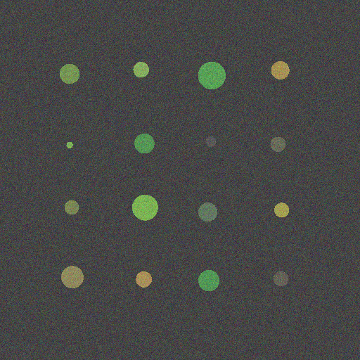
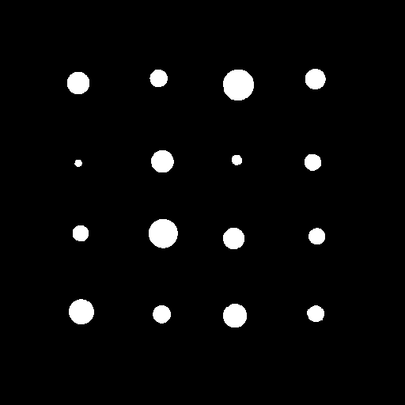
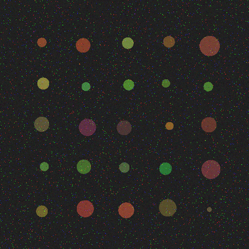
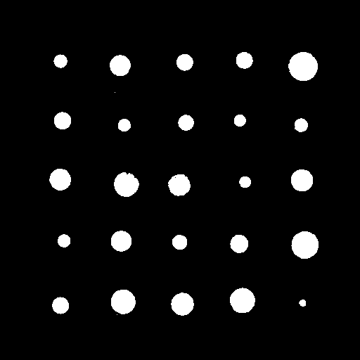
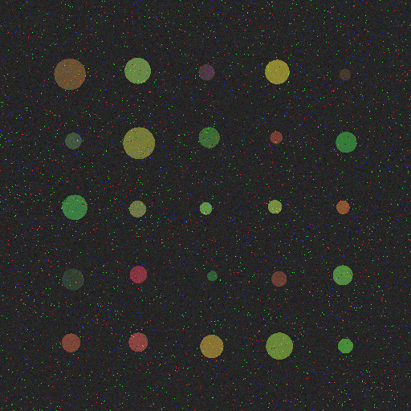
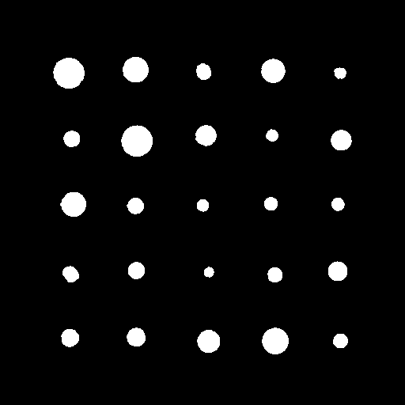
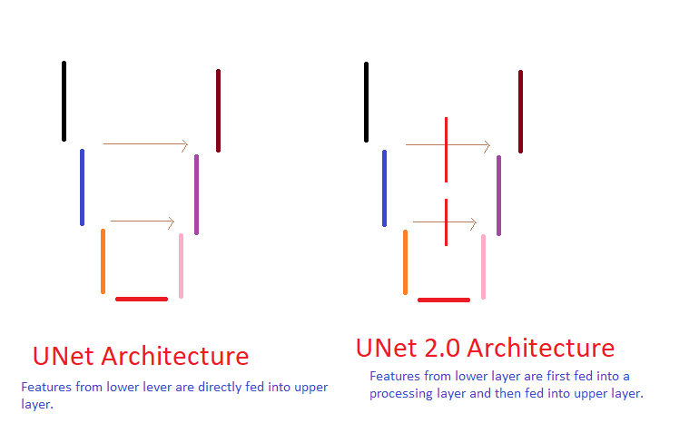

# Pytorch-UNet 2.0 for accurate stable image segmentation. Better than UNet for noisy images.
Presented network is trained for ## microarray images.
Example results:

Input Image            |  Output Segmentation Image 
:-------------------------:|:-------------------------:
  |  
  |  
  |  

UNet 2.0 is a modified version of UNet for better segmentation even image is noisy. Below is the pictorial view difference between UNet and UNet 2.0.

This is forked version of https://github.com/milesial/Pytorch-UNet. To know more about it, 
[Click Here For Original Edition](https://github.com/milesial/Pytorch-UNet) 

## Usage
**Note : Use Python 3**

Download pretrained network for noisy microarray images from [here](http://wix.to/2cAQBBA)
Unzip it (CP67.zip) in same folder. It should be now CP67.pth
Use checkoutput.py program to check output on your images.

For training on your images use train2.py. For training, program assumes input image size 512 x 512 which is broken by program into 128 x 128 for training.

There is no limitation of image size on testing/predicting/checking output.

--------below  is as in original version by milesial/Pytorch-UNet
### Prediction

You can easily test the output masks on your images via the CLI.

To see all options:
`python predict.py -h`

To predict a single image and save it:

`python predict.py -i image.jpg -o output.jpg`

To predict a multiple images and show them without saving them:

`python predict.py -i image1.jpg image2.jpg --viz --no-save`

You can use the cpu-only version with `--cpu`.

You can specify which model file to use with `--model MODEL.pth`.

### Training

`python train.py -h` should get you started. A proper CLI is yet to be added.
## Note
In order to process the image in training phase, every 512x512 input image is split into 16 squares of 128x128  and each square is passed into the net. 
For testing/predict phase, no size restriction.

## Dependencies
This package depends on [pydensecrf](https://github.com/lucasb-eyer/pydensecrf), available via `pip install`.

